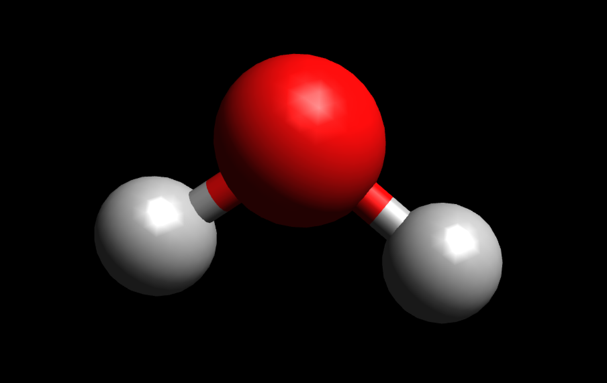

## SPC/E model (Simple Point Charge / Extended)

Here is an implementation of the [SPC/E model](https://en.wikipedia.org/wiki/Water_model) on Rust. 




| parameter                         | value  |
|-----------------------------------|--------|
| A [Å * (kJ/mol)^{1/6}]            | 3.7122 |
| B [Å * (kJ/mol)^{1/12}            | 3.4280 |
| q_O                               | -0.8476|
| q_H                               | 0.4238 |
| r(OH) [Å]                         | 1.0    |
| α(HOH) [deg]                      | 109.47 |
| r(HH) [Å]                         | 1.6330 |
| kC [Å * kJ / (mol * e^2)]         | 1394.82|
| Polarization correction [kJ/mol]  | 5.22   |

## Build
```
cd /to/relevant/folder
git clone https://github.com/AlexanderDKazakov/spce.git
cd ./spce
cargo build # cargo install
```

##Usage

```
╰─➤  ./spce
Usage: ./spce extenden_xyz_file.xyz
```

## Quick Start

You can find in assets 2 file with `2`  and `64` water molecules in order to try.

```
╰─➤  ./spce ./assets/w2.xyz > log
### SPC/E model calculation ###
File provided: ./assets/w2.xyz

Structure: #2
            LJ[kJ/mol]:       -0.210267 | [hartree] :  -0.000081
[Inter]Electro[kJ/mol]:      -18.735671 | [hartree] :  -0.007206
  Polarization[kJ/mol]:        5.220000 | [hartree] :   0.002008
  Total Energy[kJ/mol]:      -13.725938 | [hartree] :  -0.005279
[hartree]   DFT energy:      -34.444213 | N*W1      : -34.329270 | [W1] -17.164635
[hartree] (DFT-N*W1)-SPC/E:   -0.109664 | [DFT-N*W1]:  -0.114943

Structure: #2
            LJ[kJ/mol]:       -0.558537 | [hartree] :  -0.000215
[Inter]Electro[kJ/mol]:      -13.989901 | [hartree] :  -0.005381
  Polarization[kJ/mol]:        5.220000 | [hartree] :   0.002008
  Total Energy[kJ/mol]:       -9.328437 | [hartree] :  -0.003588
[hartree]   DFT energy:      -34.443134 | N*W1      : -34.329270 | [W1] -17.164635
[hartree] (DFT-N*W1)-SPC/E:   -0.110277 | [DFT-N*W1]:  -0.113864

Structure: #2
            LJ[kJ/mol]:       -0.565108 | [hartree] :  -0.000217
[Inter]Electro[kJ/mol]:      -15.784242 | [hartree] :  -0.006071
  Polarization[kJ/mol]:        5.220000 | [hartree] :   0.002008
  Total Energy[kJ/mol]:      -11.129349 | [hartree] :  -0.004281
[hartree]   DFT energy:      -34.442587 | N*W1      : -34.329270 | [W1] -17.164635
[hartree] (DFT-N*W1)-SPC/E:   -0.109037 | [DFT-N*W1]:  -0.113318
```

In `log` file you can find provided xyz positions/[forces] and etc.

## Licence
MIT